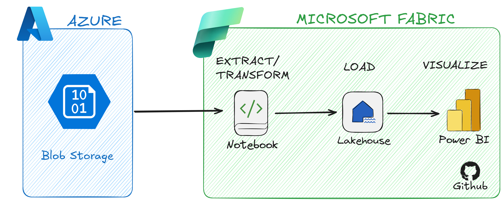

# Microsoft Fabric Data Pipeline

End-to-end data engineering project using Azure Blob Storage, Microsoft Fabric, PySpark, Lakehouse, Delta tables and Power BI.

## Project Overview

This project demonstrates the implementation of an ETL pipeline for processing retail sales data.

Raw CSV data is stored in Azure Blob Storage, ingested into Microsoft Fabric using a PySpark Notebook, cleaned and transformed, and then persisted as a Delta table in a Fabric Lakehouse.

A semantic model is created on top of the processed data and consumed by Power BI for reporting and analysis.

## Architecture



**Data flow:**

Azure Blob Storage → Fabric Notebook → PySpark → Fabric Lakehouse → Delta Table → Semantic Model → Power BI

## Technologies

- Microsoft Azure Blob Storage
- Microsoft Fabric
- PySpark
- Fabric Lakehouse
- Delta Lake
- Power BI
- Git / GitHub

## Data Pipeline

### Extraction

The raw sales dataset is stored in Azure Blob Storage and accessed from a Microsoft Fabric Notebook.

The dataset contains sales information such as:

- Sale ID
- Customer
- Product
- Quantity
- Price
- City
- Date

### Transformation

Data quality issues were intentionally included in the dataset to simulate a real-world scenario.

Using PySpark, the following transformations were performed:

- Null value handling
- Duplicate removal
- Column renaming
- Removal of unnecessary columns
- Data type conversion
- Date standardization
- Text normalization
- Creation of derived columns

### Load

The transformed PySpark DataFrame is stored in the Fabric Lakehouse as a Delta table.

```python
pipe_df.write.format("delta") \
    .mode("overwrite") \
    .saveAsTable("vendas_tratadas")
```

### Version Control

The Microsoft Fabric workspace is integrated with GitHub for version control.

Fabric artifacts such as the Notebook, Lakehouse, Semantic Model and Power BI Report are synchronized with this repository, allowing changes to be tracked through Git commits.

What I Learned

This project provided hands-on experience with:

Cloud-based data ingestion
Microsoft Fabric Data Engineering
PySpark DataFrames
Data cleaning and transformation
Delta Lake tables
Lakehouse architecture
Integration between Fabric and Power BI
Git-based version control for Fabric artifacts
Future Improvements
Implement Bronze, Silver and Gold layers
Add orchestration using Fabric Data Pipelines
Implement data quality validation
Improve credential management using Azure Key Vault
Add automated monitoring


### Author

**Pedro Hernandes**
